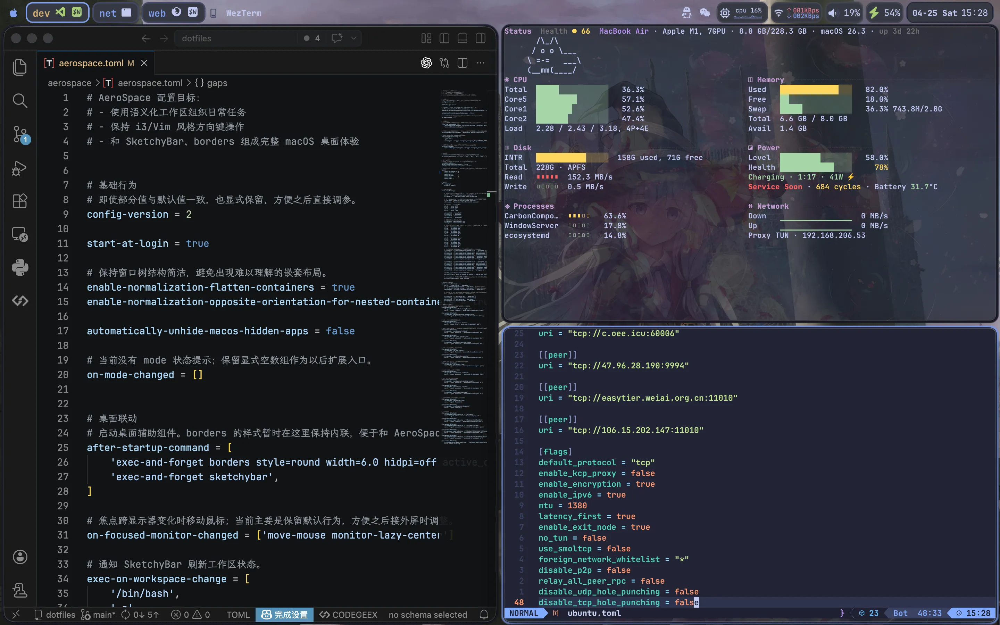
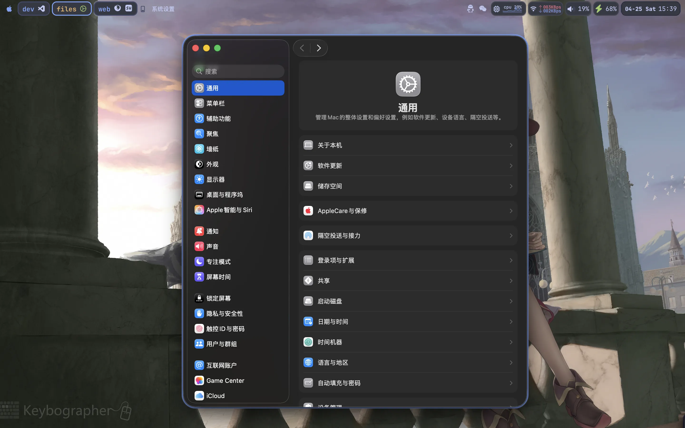
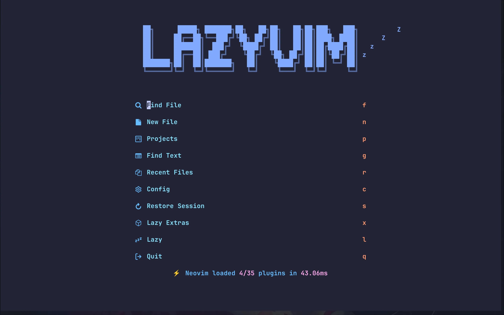
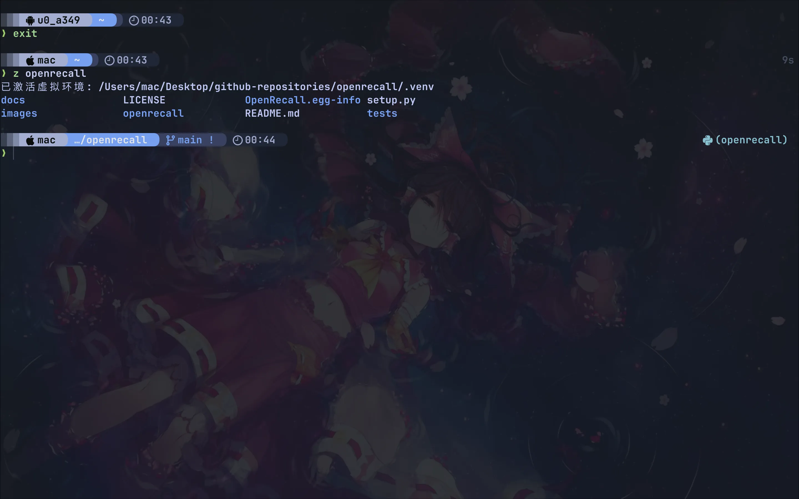
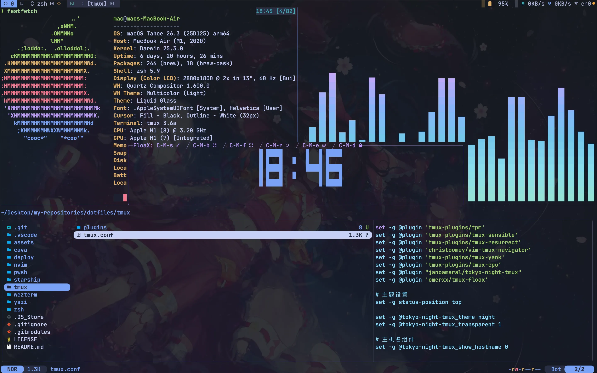
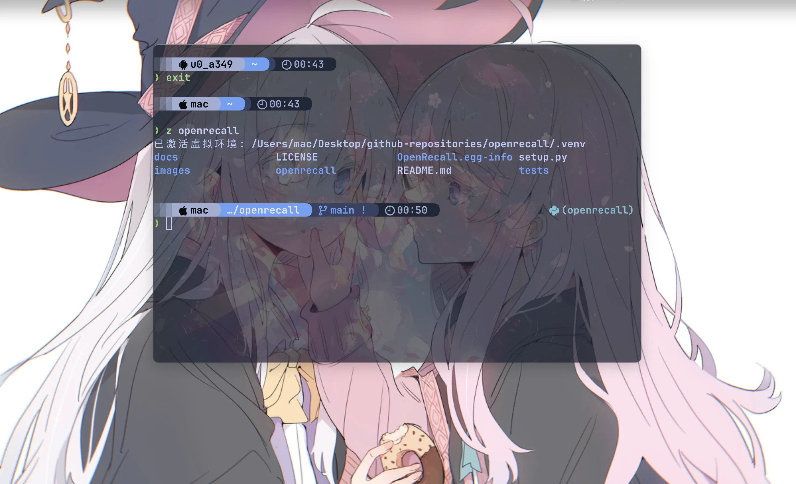
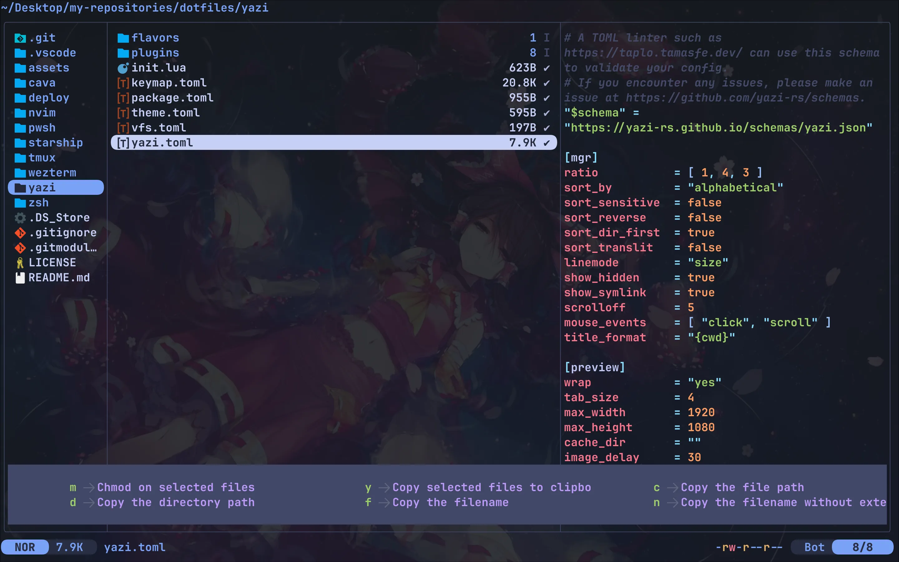

# dotfiles

这是一个用于管理个人配置的仓库（dotfiles）。

- [dotfiles](#dotfiles)
  - [1. 效果展示](#1-效果展示)
  - [2. 目录结构](#2-目录结构)
  - [3. 配置路径约定](#3-配置路径约定)
  - [4. 部署](#4-部署)
    - [4.1. Ubuntu / Linux（Ubuntu 优先）](#41-ubuntu--linuxubuntu-优先)
    - [4.2. macOS](#42-macos)
    - [4.3. Windows](#43-windows)
    - [4.4. Termux](#44-termux)
  - [5. 未来计划](#5-未来计划)
  - [许可证](#许可证)

## 1. 效果展示

<details>
<summary>aerospace</summary>

aerospace 是 macOS 的 i3 风格的平铺窗口管理器：



</details>


<details>
<summary>borders</summary>

borders 是 macOS 的窗口边框管理器，搭配 aerospace 使用，用于高亮被聚焦的窗口：



</details>


<details>
<summary>cava</summary>

cava 配置了主题颜色：


</details>


<details>
<summary>nvim</summary>

nvim 目前以 LazyVim 为主，只做了少量覆写，并接入了 tmux 导航等插件：



</details>


<details>
<summary>pwsh & zsh</summary>

基本上都是命令行的效果，无需展示。

</details>


<details>
<summary>starship</summary>

为 starship 配置了 prompt：



</details>


<details>
<summary>tmux</summary>

为 tmux 配置了状态栏以及常见插件。



</details>


<details>
<summary>WezTerm</summary>

为 wezterm 配置了主题：



</details>


<details>
<summary>Yazi</summary>

为 yazi 配置了主题以及常用插件：



</details>

## 2. 目录结构

```text
.
├── aerospace               # macOS AeroSpace 配置
├── assets                  # README 截图资源
├── borders                 # macOS borders 配置
├── cava                    # cava 配置
│   ├── macos               # macOS
│   ├── termux              # Android-termux
│   ├── ubuntu              # Ubuntu
│   └── windows             # Windows
├── deploy                  # 部署脚本（POSIX Bash + Windows PowerShell）
│   ├── macos.sh            # macOS
│   ├── termux.sh           # Termux
│   ├── ubuntu.sh           # Ubuntu 优先的 Linux 部署入口
│   └── windows.ps1         # Windows
├── LICENSE
├── nvim                    # 基于 LazyVim 的轻量定制配置
├── pwsh                                        # pwsh 配置
│   ├── Microsoft.PowerShell_profile.ps1        # pwsh 配置文件一级入口
│   └── pwsh
│       ├── Aliases.ps1                         # 别名配置
│       ├── Conda.ps1                           # conda 初始化脚本（懒加载）
│       ├── Env.ps1                             # 环境变量配置
│       ├── Functions.ps1                       # 自定义函数
│       ├── Hook.ps1                            # hook
│       ├── Microsoft.PowerShell_profile.ps1    # pwsh 配置文件二级入口
│       ├── Options.ps1                         # pwsh 选项配置
│       ├── Plugins.ps1                         # 插件配置
│       └── Secrets                             # 密码管理（除了示例文件外不会被追踪）
│           └── Example.ps1                     # 示例
├── README.md
├── sketchybar              # SketchyBar 配置子模块（独立维护，当前未纳入主部署脚本）
├── starship
│   └── starship.toml       # starship 配置
├── tmux                    # tmux 配置
│   ├── plugins             # tpm 子模块与本地插件目录
│   └── tmux.conf           # tmux 配置文件
├── wezterm                 # WezTerm 配置以及背景资源
├── yazi                    # yazi 配置
│   ├── flavors             # yazi 主题目录（可再生成资源）
│   ├── init.lua            # yazi lua 初始化脚本
│   ├── keymap.toml         # yazi 快捷键配置
│   ├── package.toml        # yazi 插件配置
│   ├── plugins             # yazi 插件目录（可再生成资源）
│   ├── theme.toml          # yazi 主题配置
│   ├── vfs.toml            # yazi 文件系统配置
│   └── yazi.toml           # yazi 主配置文件
└── zsh                     # zsh 配置
    ├── .zshrc              # zsh 配置文件一级入口
    └── zsh
        ├── aliases.zsh     # 别名配置
        ├── conda.zsh       # conda 初始化脚本（懒加载）
        ├── env.zsh         # 环境变量配置
        ├── functions.zsh   # 自定义函数
        ├── hook.zsh        # hook
        ├── options.zsh     # zsh 选项配置
        ├── plugins.zsh     # 插件配置
        ├── secrets         # 密码管理（除了示例文件外不会被追踪）
        │   └── example.sh  # 示例
        └── zshrc           # zsh 配置文件二级入口
```

## 3. 配置路径约定

本仓库采用以下约定：
**仓库只存放“源文件”，实际配置通过符号链接（symlink）映射到真实路径。**

例如：

- `~/.config/wezterm/`  ->  `dotfiles/wezterm/`
- `~/.zshrc` -> `dotfiles/zsh/.zshrc`，`~/.config/zsh/` -> `dotfiles/zsh/zsh/`
- `~/.config/starship.toml` -> `dotfiles/starship/starship.toml`
- `$PROFILE` -> `dotfiles\pwsh\Microsoft.PowerShell_profile.ps1`，`~\.config\pwsh\` -> `dotfiles\pwsh\pwsh\`
- `~/.config/yazi/` -> `dotfiles/yazi/` 或 `%AppData%\yazi\config\` -> `dotfiles\yazi\`
- `~/.config/cava/` -> `dotfiles/cava/<对应系统>`
- `~/.config/nvim` -> `dotfiles/nvim/` 或 `%LocalAppData\nvim\` -> `dotfiles\nvim\`
- `~/.config/tmux` -> `dotfiles/tmux/`
- `~/.config/aerospace/` -> `dotfiles/aerospace/`
- `~/.config/borders/` -> `dotfiles/borders/`

其中 `sketchybar/` 当前作为独立维护的子模块保留，尚未纳入主部署脚本，使用时请参考子模块内的 README 单独安装。

`locals/` 目录用于存放机器特定的本地覆盖配置，不进入 Git 追踪。例如 conda 使用懒加载——首次输入 `conda` 命令时，才会 source `~/.config/zsh/locals/conda.zsh`（或 Windows 下的 `~\.config\pwsh\Locals\Conda.ps1`）。用户需运行 `conda init zsh`（或 `conda init powershell`），然后将输出的初始化块放入对应文件即可。

## 4. 部署

部署脚本分为两套实现：

- POSIX：`deploy/macos.sh`、`deploy/ubuntu.sh`、`deploy/termux.sh`
- Windows：`deploy/windows.ps1`

两套实现共享同一套部署思路，按 deploy unit 生命周期执行：

- `prepare -> install（若缺失）-> recheck availability -> link -> update`
- 软件安装与配置链接分离；软件仍不可用时，会跳过后续 link/update，而不是强行继续
- 配置部署以符号链接为主，冲突处理统一由 `--config-mode` / `-ConfigMode` 控制

部署脚本会：

- 创建必要的目录
- 自动创建符号链接
- 对已有文件做提示，避免误覆盖
- 可以自动确认安装类操作，但配置覆盖策略需要单独指定

当前实际覆盖范围：

- macOS：字体、WezTerm、CLI 工具、zsh 插件、Starship、zsh、Yazi、Cava、LazyVim、tmux，以及 Aerospace + borders 窗口管理栈
- Ubuntu / Linux：共享 POSIX 主流程，入口脚本以 Ubuntu 为主；包管理器优先级是 `apt -> dnf -> pacman -> brew`，实测除了字体安装被跳过以外其余在 Ubuntu 均可以成功
- Windows：AltSnap、JetBrains Mono、WezTerm、PSGallery、CLI 工具、Starship、PowerShell、Yazi、Cava、LazyVim
- Termux：共享 POSIX 主流程，但 WezTerm 会被显式跳过，考虑到手机上使用 Termux 作为终端。

补充说明：

- 仓库还包含 `sketchybar/` 子模块，但它当前不在主部署脚本覆盖范围内，需要按子模块 README 单独安装。
- 仓库当前包含 `tmux/plugins/tpm` 与 `sketchybar/` 两个子模块，因此示例中的克隆命令保留 `--recurse-submodules`。

已知约束：

- Linux 部署目前是 Ubuntu 优先，不应理解为完整通用 Linux 部署器
- Ubuntu 上的 Cava 仍暂时复用 `cava/macos`，这是因为 Ubuntu 的 `cava` 暂时还没有经过测试
- Windows 的 `PSFzf` 当前只有检查占位，没有自动安装逻辑
- 自动字体安装目前主要覆盖 macOS；Windows 只单独处理 JetBrains Mono
- POSIX 在无交互 TTY 时无法确认安装类操作，这类步骤会倾向于跳过

可能的系统副作用：

- macOS 可能添加 `FelixKratz/formulae` Homebrew tap
- Ubuntu 可能添加 WezTerm 官方 APT 源
- Debian / Ubuntu 上可能创建 `/usr/local/bin/fd -> fdfind` 兼容链接
- Windows 可能注册 `PSGallery`，并在确认后把 OpenSSH 默认 shell 改成 `pwsh` 后重启 `sshd`
- Windows 未开启开发者模式且未以管理员身份运行时，符号链接创建可能失败

> 使用过程中请注意提示与警告！以免错过重要信息！
>
> 国内建议提前配置代理或镜像源

部署参数：

- POSIX（macOS / Ubuntu / Termux）：
  - `--yes-install`：自动确认安装或更新软件包、插件等安装类操作。
  - `--config-mode ask|backup|replace|replace-link|skip`：配置目标已存在时的处理方式，默认 `ask`。
- Windows：
  - `-YesInstall`：自动确认安装或更新软件包、插件等安装类操作。
  - `-ConfigMode ask|backup|replace|replace-link|skip`：配置目标已存在时的处理方式，默认 `ask`。

配置处理方式：

- `ask`：每次遇到已存在的配置目标时询问。交互时使用小写字母只对本次生效，使用大写字母会对后续全部生效。
- `backup`：备份已有符号链接、文件或目录，再创建新链接。
- `replace`：删除已有符号链接、文件或目录，再创建新链接。
- `replace-link`：已有符号链接时替换；已有文件或目录时备份。
- `skip`：已有目标时直接跳过，不创建新链接。

> `--yes-install` / `-YesInstall` 只会自动确认安装类操作，不会自动确认配置覆盖、删除、备份、快捷方式、默认 shell 等其他操作。

示例：

```bash
./deploy/macos.sh --yes-install --config-mode replace-link
```

```powershell
.\deploy\windows.ps1 -YesInstall -ConfigMode replace-link
```

### 4.1. Ubuntu / Linux（Ubuntu 优先）

推荐在 Ubuntu 上使用，并确保至少有可用的 `apt`。脚本内部对 `dnf`、`pacman`、`brew` 有部分 fallback 支持，但当前入口和实际测试范围仍以 Ubuntu 为主。

在新机器上执行以下步骤即可部署配置：

```bash
git clone --recurse-submodules https://github.com/milk2715093695/dotfiles.git
cd ./dotfiles
chmod +x ./deploy/ubuntu.sh
./deploy/ubuntu.sh
```

### 4.2. macOS

推荐提前安装 `Homebrew`。

在新机器上执行以下步骤即可部署配置：

```bash
git clone --recurse-submodules https://github.com/milk2715093695/dotfiles.git
cd ./dotfiles
chmod +x ./deploy/macos.sh
./deploy/macos.sh
```

### 4.3. Windows

- 推荐使用 `pwsh` 运行。
- 包管理器优先级为 `scoop -> winget`；至少准备其中一个。
- 推荐以管理员身份运行，或先开启 Windows 开发者模式，否则符号链接可能失败。
- 如果确认将 OpenSSH 默认 shell 切换到 `pwsh`，脚本会修改注册表并重启 `sshd`。

在 powershell 上执行以下步骤即可部署配置：

```powershell
git clone --recurse-submodules https://github.com/milk2715093695/dotfiles.git
cd .\dotfiles
Set-ExecutionPolicy Bypass -Scope Process -Force
.\deploy\windows.ps1
```

### 4.4. Termux

Termux 使用 `pkg` 作为包管理器，并会跳过 WezTerm。zsh 插件除了 `zsh-completions` 外，还会把 `zsh-autosuggestions` 与 `zsh-syntax-highlighting` 克隆到 `~/.zsh/`。

在 termux 上执行以下步骤即可部署配置：

```bash
git clone --recurse-submodules https://github.com/milk2715093695/dotfiles.git
cd ./dotfiles
chmod +x ./deploy/termux.sh
./deploy/termux.sh
```

## 5. 未来计划

- 配置
  - [X] WezTerm 配置
  - [X] zsh 配置
  - [X] starship 配置
  - [X] pwsh 配置
  - [X] yazi 配置
  - [X] cava 配置
  - [X] tmux 配置
  - [X] nvim 配置
- 部署
  - [X] Ubuntu 部署脚本
  - [X] macOS 部署脚本
  - [X] Windows 部署脚本
  - [X] Android-termux 部署脚本

## 许可证

本仓库采用 MIT 许可证。详情见 [LICENSE](./LICENSE) 文件。

关于 Windows 配置中使用 AltSnap（GPLv3）的问题：AltSnap 是 Stefan Sundin 的 AltDrag 的 fork；本仓库不包含 AltSnap / AltDrag 源码或可执行文件，部署时会从 `RamonUnch/AltSnap` 发布页下载并安装。AltSnap 许可、Wiki 与更新记录请参见：[AltSnap 仓库](https://github.com/RamonUnch/AltSnap)；AltDrag 原始文档仅作历史参考：[AltDrag 原始文档](https://stefansundin.github.io/altdrag/doc/)。
